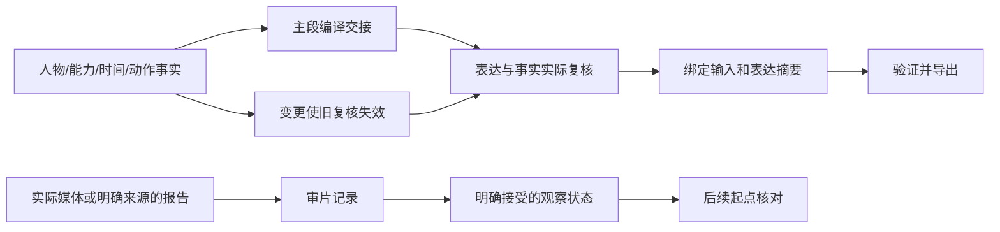

# 完善实施记录

更新于2026-09-29；当前工作区软件0.9.2，数据契约1.2（兼容读取1.1，显式迁移1.0）。原始[计划](../plans/2026-09-21-improvement-plan.md)及[0.2.0调研证据](../research/2026-09-21-skill-design-review.md)保留。下列早期阶段与后续版本分别记证据，当前汇总见[验证报告](../validation.md)。

## 已落地的阶段

| 工作包 | 状态 | 实现与边界 |
| --- | --- | --- |
| WP01 事实来源 | 本地实现完成 | headers/主段的输入与表达摘要；最终状态影响总设定；原例编辑源和固定凭证同步；旧计划不自动认定复核通过 |
| WP02 编译校验 | 本地实现完成 | 过期/缺失复核阻止导出；硬约束和动作细节由事实生成；Schema 未知约束失败；语义判断仍依赖实际复核 |
| WP03 行为评估 | 试点与十二题分版本覆盖完成 | 3题×3配置独立试点、后续扩展及实际负例均有证据；每配置三次重复比较未运行，不宣称当前版全量重复通过 |
| WP04 动作契约 | 可选基础版完成 | 兵器、事件、轨迹、回应、接触、持物转移、能力阶段与限制；结构状态为权威；不做物理模拟或任意能力推理 |
| WP05 知识与案例 | 本轮范围完成 | 窄巷取函、三人画外护送、环境反制失败；证据拆解、模板变量和空间修订检查 |
| WP06 审片回流 | 本地流程完成 | 未观察模板、范围/音轨边界、接受偏差、起点种子和下一计划检查；脚本不读取媒体内容 |
| WP07 平台/素材证据 | 离线检查完成 | 已知/未知/过期与时长冲突、绑定凭证来源；真实平台配置仍未知，没有平台连接器 |
| WP08 宿主与分发 | 本地打包、发现、调用与临时生命周期完成 | 0.9.1临时安装/升级/回滚/卸载；0.9.2定向读取恢复已验；不推断所有宿主兼容，日常插件未升级 |

## 实际数据流

结构化动作模式下，旧 before/after 字符串由状态投影生成，校验器拒绝两个状态来源不一致。非结构化旧例继续保留文字事实，不凭空补写动作细节。

## 实施中发现并处理的问题

1. 原先改武器、动作或代价不影响提示词：现在相应复核失效，正式导出被拦截；关键事实也进入硬约束。
2. 只检查输入摘要仍可能漏掉表达修改：输入和表达分别绑定；一镜到底摘要改成切镜后失效。否定句“不切镜”不按关键词误判。
3. 最终状态可能与总设定结尾不同步：总设定复核加入最终状态依赖。
4. 新动作结构不能成为第三份独立事实：旧状态文本改为严格投影，而非要求维护者手动同步两套结构。
5. 初次独立评估里，新版木杖输出存在西南退步与北缘终点冲突：保留失败记录，补充世界方向路径核对，再独立重测。不能以 receipt 存在或结构通过掩盖这个问题。

## 工程入口

生产命令、复核示例见[数据契约](../../skills/combat-director/references/contract.md)。可选动作见[动作契约](../../skills/combat-director/references/action-contract.md)，观察回流见[审片流程](../../skills/combat-director/references/review-loop.md)。

重建必须使用 `scripts/rebuild_examples.py` / `scripts/build_action_examples.py`；更改源内容后实际复核并更新 `sources/editorial/` 的凭证，不允许自动刷新哈希骗过检查。原件在 `sources/attachments/2026-09-21`，未改变。

完整本地检查：安装 `requirements-dev.txt` 后执行 `python scripts/validate_release.py`。证据写入同目录 `validation-<version>.json`；摘要见[当前验证报告](../validation.md)。0.5.0的23项流程检查和44通过/1跳过单测证据独立保留，不自动算作新版已执行。

早期[行为报告](behavior-evaluation.md)记录12次任务执行、5个场景。初次木杖修订失败保留；0.5.0独立复核为7/8，时长冲突与接受偏差续接两例内容通过。其余7个场景在当时未执行，已于2026-09-29由扩展与实际宿主任务补齐；这些新结果不倒填为0.5.0成绩。

## 剩余验证与扩展

- 扩展12题的多次独立比较、隐式触发/负例、更多模型环境；当前试点不能给出普适成功率。
- 实际Codex基础隐式路由、独立会话及卸载已留证；更广宿主/配置覆盖仍属后续扩展，不把本机条件推广为所有调用场景通过。
- 实际平台模型/入口/账号能力，以及用户授权素材上的视频试验；尚无可据此宣称已验证的媒体效果。
- Python最低声明版本3.10已于2026-09-24通过当前0.9.0的95项单测（93通过、2跳过），见[记录](compatibility-python310-0.9.0.json)。Linux启动因本机WSL磁盘缺失失败，仍未测；历史3.11结果仅代表当时45项测试，不沿用为当前覆盖。
- 地面拾取、持续共持、解除能力限制等动作语法尚未实现；按真实任务增加，避免把自由文字伪装成程序已检查。

0.5.0已按用户指定推送到公开仓库 `Wilder1222/combat-director`。0.6.0属于文字知识和案例修订，仍不宣称达到1.0效果验证范围。开源许可证尚未指定。

## 0.6.0：来自六份新提示词的补充

[详细拆解](../research/2026-09-22-combat-prompt-breakdown.md)逐一分析八套方案、共用骨架、角色能力变化、具体断点与修订理由。Skill增加提示词改写和登场预告路由、动作桥接、主剑/剑影区分、弱点回收、相机与世界路径、台词预算及局部速度例外，并提供两份完整文字例。

新增内容没有扩张动作JSON语法，原六套计划与固定复核凭证维持原样。发布检查自动遍历两批附件清单。两题初轮四次独立文字测试、一次针对性复测和一次匿名复核见[本轮行为评估](prompt-evaluation-0.6.0.md)，不混入原12题覆盖数；样本来自同一批分析素材，不能作为未见素材泛化成绩。

## 0.7.0：动作设计、多人调度与机制库

已补齐最新对话附件提出的动作档案、场面调度与按需检索流程，增加七张原创条件化机制卡和两套完整文字案例。普通动作与幻想能力分开；搜索结果只作候选，不写入计划、不授予能力。具体来源和主任务人工文本对读见[融合记录](../research/2026-09-22-skill-library-integration.md)。

新增九项检索/索引测试和解压独立库检查；实际计数与证据见[当前验证](../validation.md)。没有改计划1.2结构，也没有自动同步LibTV适配器或升级已安装插件。2026-09-23按用户授权进行0.7.0源码提交推送，其他本地适配工作单独保留。本轮没有独立模型比较与真实视频验证，不能沿用0.6.0成绩作为0.7.0行为结果。

## 0.8.0：招式与战斗设定吸收

从固定的Arvin原件生成109张资料卡，保留七张原创机制，新增招式转译流程与两套文字例。按武学/角色/内容层级检索，源文、改编和缺失范围分开；上游相互冲突的绯雪版本分别选择。来源与维护边界见[本次吸收记录](../research/2026-09-23-arvin-combat-integration.md)，逐卡范围见[覆盖清单](arvin-library-coverage.json)。当前验证结果见[验证报告](../validation.md)。

## 0.8.1：审阅问题修复

WP01—WP03已实现：正式构建统一来源/生成检查并保护旧ZIP，37条显式分类关联修复检索漏项，受管理产物支持只读预览、退役、回滚及中断恢复。原审阅探针与证据保持不变。实际发布验证见[当前报告](../validation.md)。WP04—WP06中的招式条目粒度、加载精简及独立创作行为比较尚未实施；本轮没有改变计划1.2或LibTV独立适配。

## 0.8.2：Niagara粒子行为专项

根据用户补充的分享完成[一手资料调研](../research/2026-09-23-niagara-prompt-research.md)，新增按需粒子参考、两套完整文字例、六轨入口和预检。已区分特效外观与能力授权、引擎制作与普通视频描述。按[专项计划](../plans/2026-09-23-niagara-integration-plan.md)验收；工程结果见[当前验证](../validation.md)，视频A/B/C对照未运行。此项不替代整体WP04—WP06，整个项目完善目标仍在推进。

## 0.8.3：运动成像专项

[调研](../research/2026-09-23-motion-blur-research.md)之后按[融入计划](../plans/2026-09-23-motion-blur-integration-plan.md)落实按需参考、镜头与粒子协同、两套完整结构化案例和双层传递回归。作者计划及复核凭证位于sources/editorial/0.8.3，通过scripts/build_motion_examples.py生成六份产物；正式构建会核对来源与派生一致性。程序不把快门词当成新参数，也不自动替作者概括镜头说明。

本轮36项发布检查通过；84项单测中82通过、2项Windows符号链接条件跳过。[独立文字评估](motion-blur-behavior-0.8.3.md)在冻结0.8.2/0.8.3快照上完成15次执行及匿名复核：候选11满足、1题因互斥条件待取舍而为部分，旧版3满足；不宣称整体质量提升。视频对照未运行。WP04逐招详情、WP05读取精简及WP06全库行为验证仍是总目标的后续工作。

## 0.9.0：逐招来源与紧凑检索

2026-09-24完成WP04与WP05工程接入：1466项逐招记录、行内流派与角色上下文、名称/描述/动作路径分级、精确源行及同源别名；卡索引和旧ID不变。新增items/item，卡搜索默认精简，原文显式展开，无Python分类导航可用。共用规则集中，所有派生物纳入可恢复生成管理。

41项工程检查通过，95项单测中93通过、2项Windows条件跳过；首次系统Python缺少jsonschema的失败记录保留，项目虚拟环境复测通过。[实现说明](library-items-0.9.0.md)与[读取测量](library-retrieval-0.9.0.json)区分展示长度与内部索引读取代价。冻结0.8.0和0.9.0后开始WP06九类独立任务，评估尚未收口；未沿用motion专项成绩，未安装、提交或推送。

## 0.9.1：运动成像交接增量

已按深化计划落实P1a/P1b：图生/文生信息组织、精确轨迹控制边界、提交及提示改写证据、原片与后期观察分离。入口正文和数据契约未扩张，[实现记录](motion-blur-integration-0.9.1.md)对应四份运行资源。

本次正式流程41项通过，95项单测中93通过、2跳过；187文件的新包已冻结。四题motion增量和六题原扩展缺项的请求及测试素材已准备，尚未执行。资料库WP06继续使用0.8.0/0.9.0原快照；两项评估互不冒用。实际宿主和媒体条件仍按完成核对单推进。

资料库18次独立执行已全部归档，匿名语义评审进行中。0.9.1另完成本机CLI临时配置中的安装、升级、回滚和卸载，以及app-server对独立`.agents/skills`目录的实际发现；见[宿主验证](host-verification-0.9.1.md)。这些结果不证明模型的隐式选择或桌面新会话加载，日常安装版本未变。

## 2026-09-29：独立复核收口与扩展继续

资料库WP06完成18次执行及三组匿名复核：[报告](library-behavior-0.9.0.md)保留候选9满足、基线8满足1部分、8持平1偏好候选，以及轻微问题和来源补查。0.9.1的四题motion增量也完成独立复核，均满足对应文字请求，见[专项报告](motion-blur-behavior-0.9.1.md)。这些结果不证明视频效果。

原扩展E07/E08已执行，语义复核待收口；E05/E06旧句柄缺失且产物不完整，原件保留后在独立目录重跑；E09正在执行。实时状态见[实验记录](../../evals/results/extension-0.9.1/experiment.json)。宿主调用、其余扩展及条件化媒体试验继续列在完成核对中。

同日后续：六题原缺项均完成执行和独立语义复核，[结果](extension-behavior-0.9.1.md)保留两次中断与E09实际导出范围；原E11负例以及显式/隐式调用在实际CLI中完成，[宿主报告](host-routing-0.9.1.md)保存全部9次尝试，只有最后3次用于候选判断。原十二题现已有分版本覆盖，不能标成0.9.1全量重复测试。媒体里程碑与更广建议矩阵仍未执行。

## 2026-09-29：媒体对照离线准备

将motion试点落实为[可审阅草案包](../../evals/media-motion-draft-2026-09-29/README.md)：固定木杖、侧向追逐、附刃尾迹三场景，D/B各三次，共六份文本与18条计划样本。每对B仅追加局部模糊段，基础动作、机位和结尾相同；清单保留文本哈希、随机排程、空执行字段，另备分轴观察模板。

状态为`draft_not_submittable`，8秒、16:9、文生模式均待入口核验，排程随机种子不是视频种子。未提交服务、未生成媒体、未审片；[25项准备检查](../../evals/media-motion-draft-2026-09-29/preparation-check.json)只支持草案一致性。当前融入计划已改正过时的“文字任务未执行”状态，历史报告不改成绩。0.9.1运行文件与既有ZIP未因本轮文档工作变化。

## 2026-09-29：四类请求的长短宿主矩阵

完成显式motion、隐含高速交刃、无媒体拖影诊断及静态对峙各长短版本，共八次独立实际CLI调用与两组独立语义复核。[报告](host-motion-matrix-0.9.1.md)中八份文字均满足请求及字数限制，每个临时项目的186份技能文件与冻结包一致。

读取结果单列：四次运动请求取得完整可读motion正文；两次短稿虽选中正确路径，中文输出仍乱码且没有恢复完整正文，不能记为加载通过。静态两题没有强加motion。矩阵执行完成不等于所有加载验收通过，下一步处理Windows读取恢复；不据此修改动作规则或宣称媒体效果。运行包仍为0.9.1，日常插件未升级。

## 0.9.2：乱码后的参考读取恢复

在SKILL入口增加ASCII可读的恢复指引：乱码不算读取成功，按UTF-8重新取得入口与所需参考，Python可用时以ASCII转义JSON传递正文。仅入口与插件清单变化，其他185个运行文件与0.9.1相同；正式发布流程41项通过，95项单测93通过、2项Windows条件跳过。

以原请求复测MXH04、MXH06，两题均在乱码后取得SKILL与motion完整正文，解码匹配冻结包；另测MXH08静态短稿，没有强加motion。三份最终文字独立复核均满足。[恢复报告](encoding-recovery-0.9.2.md)保留原始事件和边界：没有修复宿主底层乱码，也不推断所有环境都能恢复。旧0.9.1失败与ZIP保留，日常插件未升级。

最终[逐项交付核对](requirements-closeout-2026-09-29.md)覆盖原八个工作包、0.8.0六项优化及Niagara/motion专项，确认审阅、研究、计划及必做本地交付完成。建议性扩大重复、条件化视频试验和未授权发布仍各自标为未执行，不作为已通过结果；维持0.x文本功能交付边界。
