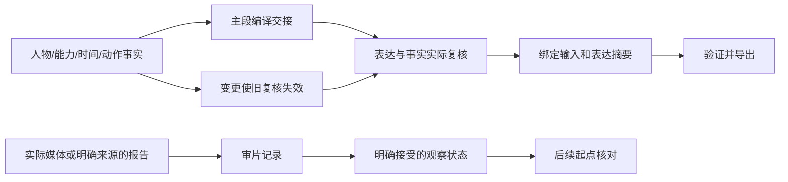

# 完善实施记录

更新于2026-09-23；当前软件0.8.1，数据契约1.2（兼容读取1.1，显式迁移1.0）。原始[计划](../plans/2026-09-21-improvement-plan.md)及[0.2.0调研证据](../research/2026-09-21-skill-design-review.md)保留。

## 已落地的阶段

| 工作包 | 状态 | 实现与边界 |
| --- | --- | --- |
| WP01 事实来源 | 本地实现完成 | headers/主段的输入与表达摘要；最终状态影响总设定；原例编辑源和固定凭证同步；旧计划不自动认定复核通过 |
| WP02 编译校验 | 本地实现完成 | 过期/缺失复核阻止导出；硬约束和动作细节由事实生成；Schema 未知约束失败；语义判断仍依赖实际复核 |
| WP03 行为评估 | 试点已运行，扩展仍待完成 | 3题×3配置独立试点、匿名内容评审；补充修订重测与两个新流程；不是全部12题×重复运行 |
| WP04 动作契约 | 可选基础版完成 | 兵器、事件、轨迹、回应、接触、持物转移、能力阶段与限制；结构状态为权威；不做物理模拟或任意能力推理 |
| WP05 知识与案例 | 本轮范围完成 | 窄巷取函、三人画外护送、环境反制失败；证据拆解、模板变量和空间修订检查 |
| WP06 审片回流 | 本地流程完成 | 未观察模板、范围/音轨边界、接受偏差、起点种子和下一计划检查；脚本不读取媒体内容 |
| WP07 平台/素材证据 | 离线检查完成 | 已知/未知/过期与时长冲突、绑定凭证来源；真实平台配置仍未知，没有平台连接器 |
| WP08 宿主与分发 | 打包与独立运行完成；本机安装另记 | 固定发布包及校验和、包外研究与评估隔离；安装状态与版本哈希见当前验证，完整跨环境路由/卸载尚未覆盖 |

## 实际数据流

结构化动作模式下，旧 before/after 字符串由状态投影生成，校验器拒绝两个状态来源不一致。非结构化旧例继续保留文字事实，不凭空补写动作细节。

## 实施中发现并处理的问题

1. 原先改武器、动作或代价不影响提示词：现在相应复核失效，正式导出被拦截；关键事实也进入硬约束。
2. 只检查输入摘要仍可能漏掉表达修改：输入和表达分别绑定；一镜到底摘要改成切镜后失效。否定句“不切镜”不按关键词误判。
3. 最终状态可能与总设定结尾不同步：总设定复核加入最终状态依赖。
4. 新动作结构不能成为第三份独立事实：旧状态文本改为严格投影，而非要求维护者手动同步两套结构。
5. 初次独立评估里，新版木杖输出存在西南退步与北缘终点冲突：保留失败记录，补充世界方向路径核对，再独立重测。不能以 receipt 存在或结构通过掩盖这个问题。

## 工程入口

生产命令、复核示例见[数据契约](../../skills/combat-director/references/contract.md)。可选动作见[动作契约](../../skills/combat-director/references/action-contract.md)，观察回流见[审片流程](../../skills/combat-director/references/review-loop.md)。

重建必须使用 `scripts/rebuild_examples.py` / `scripts/build_action_examples.py`；更改源内容后实际复核并更新 `sources/editorial/` 的凭证，不允许自动刷新哈希骗过检查。原件在 `sources/attachments/2026-09-21`，未改变。

完整本地检查：安装 `requirements-dev.txt` 后执行 `python scripts/validate_release.py`。证据写入同目录 `validation-<version>.json`；摘要见[当前验证报告](../validation.md)。0.5.0的23项流程检查和44通过/1跳过单测证据独立保留，不自动算作新版已执行。

[行为报告](behavior-evaluation.md)记录12次任务执行、5个场景。初次木杖修订失败保留；0.5.0独立复核为7/8，时长冲突与接受偏差续接两例内容通过。其余7个场景仍未执行，不把代码单测或教学例算成独立行为结果。

## 剩余验证与扩展

- 扩展12题的多次独立比较、隐式触发/负例、更多模型环境；当前试点不能给出普适成功率。
- 扩展实际Codex的隐式路由、跨会话调用和卸载检查；本机CLI安装状态与缓存文件一致不等于所有调用场景通过。
- 实际平台模型/入口/账号能力，以及用户授权素材上的视频试验；尚无可据此宣称已验证的媒体效果。
- Python最低声明版本3.10和 Linux 的实际执行；Windows Python3.13与3.11已运行同一组测试，结果单独记录。
- 地面拾取、持续共持、解除能力限制等动作语法尚未实现；按真实任务增加，避免把自由文字伪装成程序已检查。

0.5.0已按用户指定推送到公开仓库 `Wilder1222/combat-director`。0.6.0属于文字知识和案例修订，仍不宣称达到1.0效果验证范围。开源许可证尚未指定。

## 0.6.0：来自六份新提示词的补充

[详细拆解](../research/2026-09-22-combat-prompt-breakdown.md)逐一分析八套方案、共用骨架、角色能力变化、具体断点与修订理由。Skill增加提示词改写和登场预告路由、动作桥接、主剑/剑影区分、弱点回收、相机与世界路径、台词预算及局部速度例外，并提供两份完整文字例。

新增内容没有扩张动作JSON语法，原六套计划与固定复核凭证维持原样。发布检查自动遍历两批附件清单。两题初轮四次独立文字测试、一次针对性复测和一次匿名复核见[本轮行为评估](prompt-evaluation-0.6.0.md)，不混入原12题覆盖数；样本来自同一批分析素材，不能作为未见素材泛化成绩。

## 0.7.0：动作设计、多人调度与机制库

已补齐最新对话附件提出的动作档案、场面调度与按需检索流程，增加七张原创条件化机制卡和两套完整文字案例。普通动作与幻想能力分开；搜索结果只作候选，不写入计划、不授予能力。具体来源和主任务人工文本对读见[融合记录](../research/2026-09-22-skill-library-integration.md)。

新增九项检索/索引测试和解压独立库检查；实际计数与证据见[当前验证](../validation.md)。没有改计划1.2结构，也没有自动同步LibTV适配器或升级已安装插件。2026-09-23按用户授权进行0.7.0源码提交推送，其他本地适配工作单独保留。本轮没有独立模型比较与真实视频验证，不能沿用0.6.0成绩作为0.7.0行为结果。

## 0.8.0：招式与战斗设定吸收

从固定的Arvin原件生成109张资料卡，保留七张原创机制，新增招式转译流程与两套文字例。按武学/角色/内容层级检索，源文、改编和缺失范围分开；上游相互冲突的绯雪版本分别选择。来源与维护边界见[本次吸收记录](../research/2026-09-23-arvin-combat-integration.md)，逐卡范围见[覆盖清单](arvin-library-coverage.json)。当前验证结果见[验证报告](../validation.md)。

## 0.8.1：审阅问题修复

WP01—WP03已实现：正式构建统一来源/生成检查并保护旧ZIP，37条显式分类关联修复检索漏项，受管理产物支持只读预览、退役、回滚及中断恢复。原审阅探针与证据保持不变。实际发布验证见[当前报告](../validation.md)。WP04—WP06中的招式条目粒度、加载精简及独立创作行为比较尚未实施；本轮没有改变计划1.2或LibTV独立适配。
