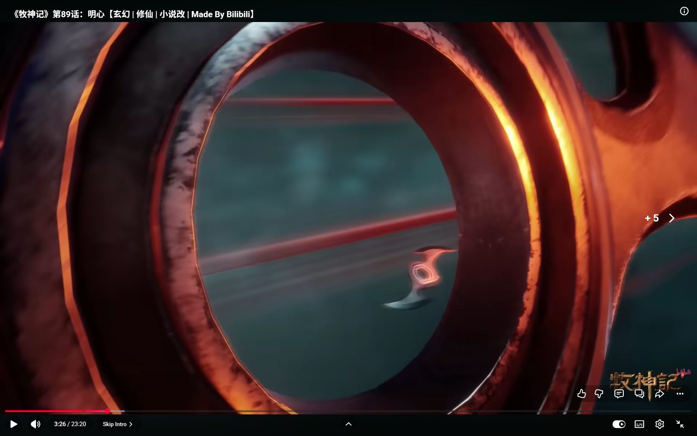
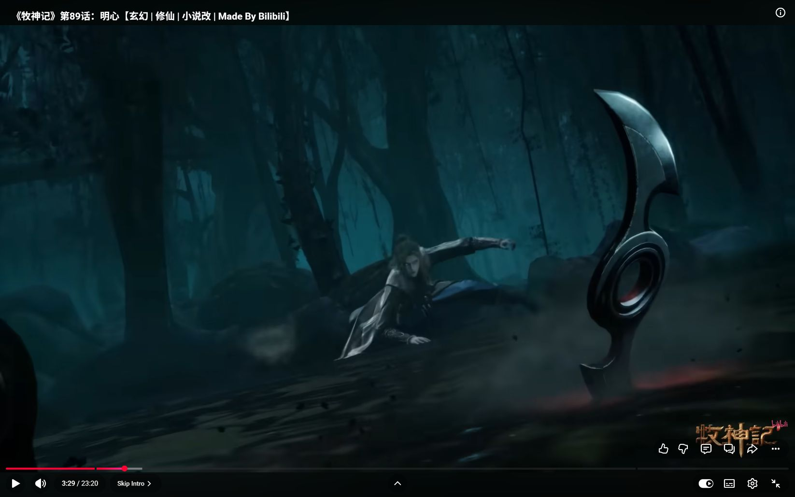
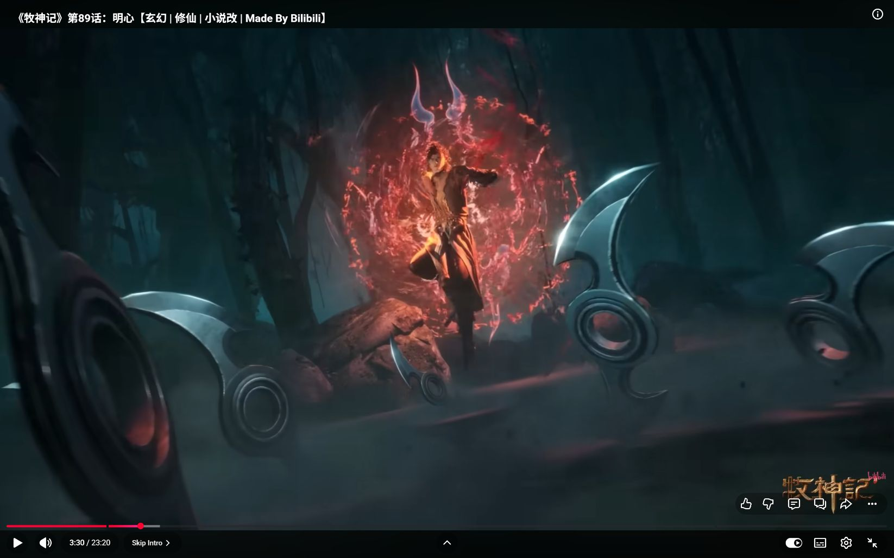
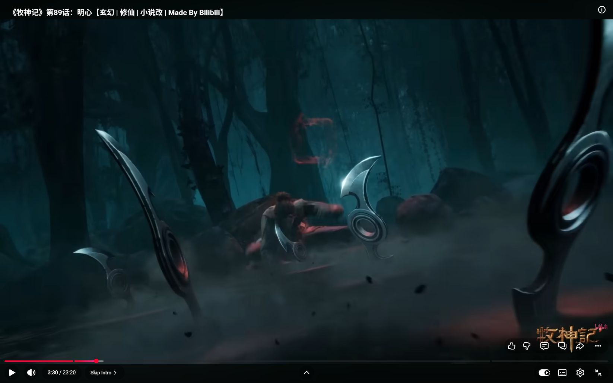
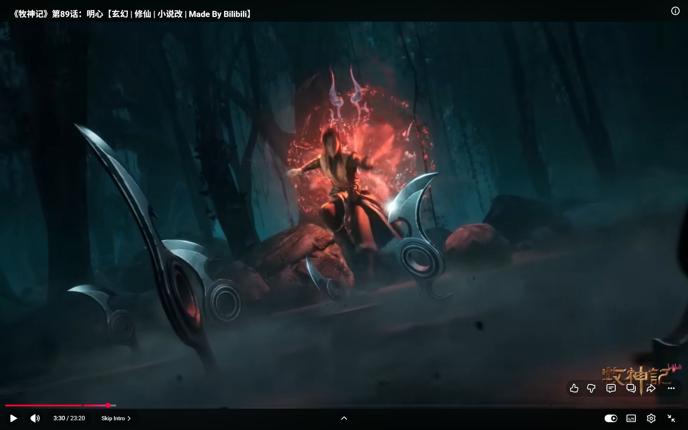
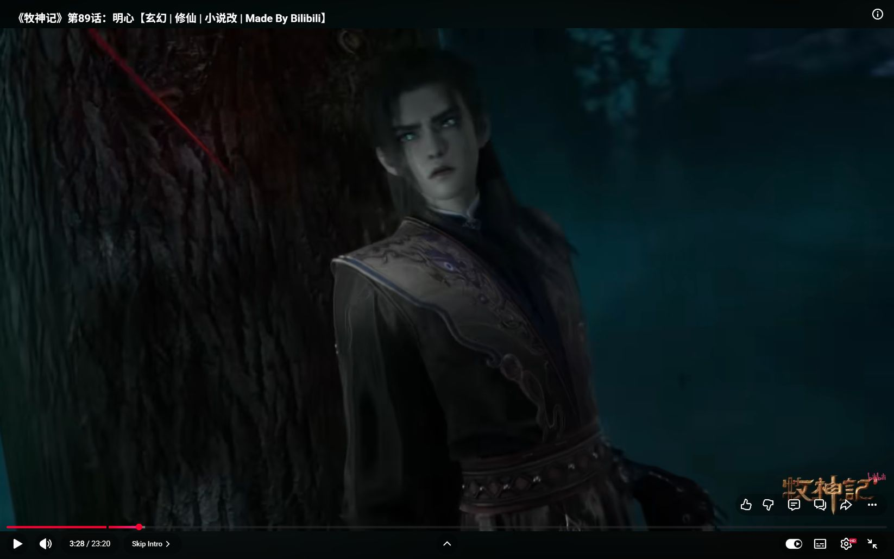
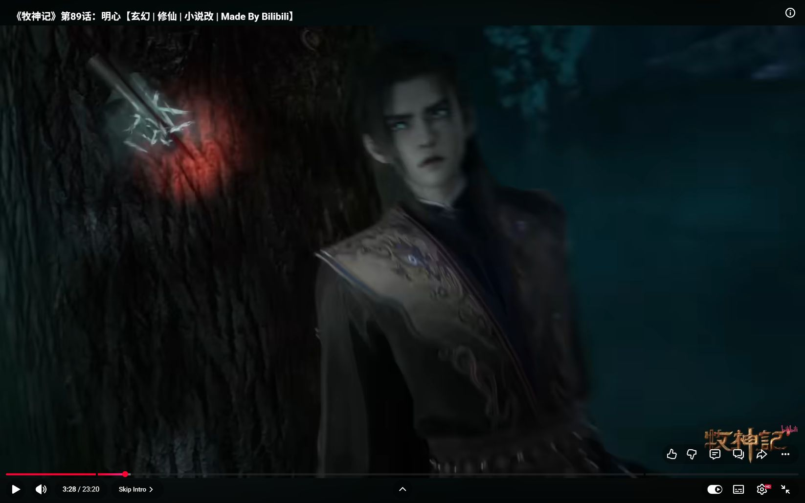
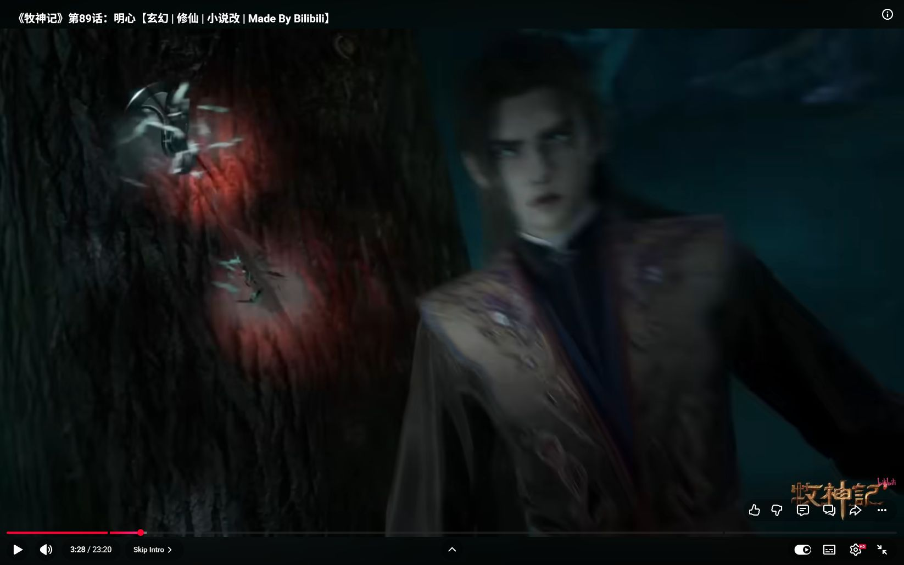

# 《牧神记》EP89：飞刃前景、低姿避让与支撑窗口

本次完成此前采集画面的复核与归档，扩充为第六部作品的局部参考。没有生成新视频，也没有把暂停截图当作正常速度连续审片。重点是威胁如何进入画面、避让如何被看清，以及哪些恢复动作仍缺证据。

## 来源和观察范围

- [原片：《牧神记》第89话：明心](https://www.youtube.com/watch?v=FpyuI7m3wrw)，页面时长23:20。2026-09-30重新读取页面，上传者为带认证标记的“哔哩哔哩动画Anime Made By Bilibili - 欢迎订阅 -”，链接指向`@MadeByBilibili`；[页面证据](evidence/mushen-2026-09-30/source-page-verified.txt)。当前显示约41万次观看，只是该上传页的受众信号，不据此推出全平台热度排名或作品风格代表性。
- 既有30次暂停截图：7次定位、15次动作采样、8次支撑区加密；播放器时间190.02—220.02秒，主要分析205.02—214.019972秒。本轮重新打开14张关键原图，不新增动作帧。
- 所有采集记录为暂停、ready=4、解码1920×1080；截图实际尺寸另见[文件清单](evidence/mushen-2026-09-30/manifest.json)。这是播放状态记录，不能单独证明画面清楚或所有动作连续。
- [原始时间记录](evidence/mushen-2026-09-30/observations.json)与[文件完整性检查](evidence/mushen-2026-09-30/validation.json)保留采集边界。没有源视频文件哈希、可靠源帧率、连续音轨审阅或精确切点测量。播放器UI和少量跳转提示保留在原图中。

## 按事件而非截图计数

|播放器秒数／文件|画面可见|解释与证据上限|
|---|---|---|
|205.02，locate-a3|戴帽男子手指穿入小型弯刃器物的环孔，刃缘有冷亮反光|交代器物结构和握持；不能据此确认整组飞刃总数、复制或控制机制。|
|206.019999，dodge-b0|一件环孔弯刃占据巨大前景，环孔内另见较小刃形，背景有红色线迹|通过前后尺寸差突出临近威胁；不证明器物变大，也不证明红线是独立伤害体。|
|208.519996，dodge-b3|树干侧面有弯刃及红色亮区，青年处于树旁较低位置，红线穿过背景|实体落点与避让位置在同一构图中出现；支持树干处交互结果，首次触树与是否逼迫该步仍缺连续过程。|
|209.019992，dodge-b4|青年离地、躯干后倾、双腿改变姿态|显示空中姿势，不足以回推出确切蹬地、腾跃方向、受击原因或飞行能力。|
|209.419968，support-c3|大弯刃占前景，尘团贴地，人物大部分被遮|这是可见性低点；不能拿遮住的姿态补出身体命中、换边或切镜。|
|209.519967—209.619966，support-c4/c5|前景刃移至右侧后，青年低姿与近侧手掌贴地可辨，另一臂后伸|威胁前景让出支撑区域；能确认贴地姿态，不能量化掌部承重或认定已完全制动。|
|209.819964，support-c7|三件清楚的前景刃形分布在青年前侧，尖端邻近地面，尘屑扬起；低姿与手掌仍可辨|同一构图内增加临近危险，人物没有因此出现三次可见身体受创；刃数增加不自动等于新增三次发招。|
|210.519984，dodge-b7|青年身体更直、一腿抬起，身后出现红色圆形纹样及两条角状亮线，前景刃仍在|可见姿态与特效改变；低姿到此姿态之间的落掌、离掌和足下再发力没有完整覆盖，圆形纹样功能未证实。|
|211.019983—211.519982，dodge-b8/b9|视野朝上，有近景刃及红轨；随后刃缘缺口与散片可见|可记录器物外形变化与碎片，不能从半秒间隔确认谁击碎、首次接点或精确断裂过程。|
|212.019978，dodge-b10|黑衣蒙面人物处在另一森林构图下方，后方仍有红轨|服饰与脸部遮挡有别，不与此前青年合并为同一动作主体。此单人镜不能建立全部攻守者的位置。|
|213.519973—214.019972，dodge-b13/b14|有纹饰肩部和护臂的青年重新占据较大画幅，背后红色圆纹保留，随后见手臂及面部近景|局部视觉标识延续；不据此认定传送、普通连续跳跃、重新出招或全局轴线正确。|

## 招式、特效与摄影分别借什么

**招式与动作连贯。** 这段有价值的是“临近飞刃—低姿回应—仍受威胁的支撑姿态”。防守没有被写成一次静止格挡，环境落点与身体避让同框，能让危险继续存在。当前证据尚不足以给它命名为完整的“蹬地—翻身—落掌—反弹”连招；尤其不能因为后面身体升高，就补造前面的手掌推地。

**特效。** 红色线迹、金属刃形、地面尘屑、背后的红色圆纹承担不同信息：路径提示、实体威胁、环境交互结果和另一种视觉状态。它们不能合并成一团“红光爆发”。当前只确认这些形态可见，没有证实每条红线的能力、圆纹的法术种类或碎刃触发者。

**机位与构图。** 206秒的环孔极近景把威胁放到观看者面前；209.5—209.8秒低角度斜构图把大刃放在前景、青年留在中景、树干保留在后景。更值得迁移的是前景轮廓之间留出的支撑窗口：手掌与躯干仍能被辨认。画面倾斜不能单独证明地面真实坡度；人物和地表关系需另查。

**运镜与切镜。** 209.419968—209.619966之间，刃的屏幕位置变化并逐渐让出人物，固定树干和低姿主体可继续追踪。这支持讨论遮叠变化，尚不足以宣布无剪辑、精确跟拍速度、推镜距离或遮挡硬切。本批没有相邻源帧级边界核验，因此不报镜数、平均镜长、Hit Stop长度或“全段无越轴”。

**力感。** 刃尖附近尘团、树干处结果和青年贴地姿态提供实体感；没有观察到同等明确的刃入身体与受击滑退链。声音未实听，不能宣称采用了低频、破风断音或呼吸设计。

## 可迁移方法与条件

本轮没有再向技能添加同义规则：已有“遮挡范围与读位范围”“整段刀刃扫掠”“支撑后反击”已覆盖这里的可迁移条件。研究新增的是实际参考依据与限制，并补入[六部作品对照](2026-09-30-donghua-crosswork-synthesis.md)。

## 关键原图

206.019999秒：环孔近景的尺度来自透视，不能当作武器突然巨大化。

209.619966秒：前景刃、人物低姿与近侧手掌同框，这是本次最有用的支撑可见性参考。

210.519984秒：身体升高与红纹出现可见，但中间如何恢复支撑尚未闭合。

首次报告后优先补查209.819964—210.519984之间手掌离地、脚部受力与圆纹出现的先后；结果见下节。208秒附近首次触树、正常速度、实际音轨和更广作品覆盖仍未完成。

## 后续补查：低姿收身与红纹展开

新增16次已解码暂停截图，包含5次小画幅采样与同区间5次大画幅复查；它们不是16个独立源帧。[采集记录](evidence/mushen-recovery-2026-09-30/observations.json)、[文件清单](evidence/mushen-recovery-2026-09-30/manifest.json)、[完整性检查](evidence/mushen-recovery-2026-09-30/validation.json)分别记录时间、尺寸与哈希。两次ready=1的定位尝试没有保存图像，列入[未采纳定位记录](evidence/mushen-recovery-2026-09-30/skipped-attempts.json)。本轮不把这些等待解码的尝试算视觉证据。

|采样秒数／大画幅文件|进一步看清的变化|仍不能推出的结论|
|---|---|---|
|209.969769，rise-a2|人物仍低姿，近侧手掌区贴近地表，另一臂后上伸；小前景刃已部分遮住掌部|不能因掌部贴近地面就认定承担全部体重或身体速度归零。|
|210.069765，phase-full-c0|头和躯干比前一姿态更低，后上伸臂回落，身体有收拢变化；背后尚未形成明显展开的红圈|支持起动前收身这一姿态顺序，不代表量化了蓄力大小或确切肌肉发力。|
|210.103098，phase-full-c1|背后树干前出现细小红色轮廓，青年仍处低位；掌腕附近已模糊|此时特效可见，不足以确认掌部首次离地或首次法术触发帧。|
|210.136431，phase-full-c2|红形展开成瓣状放射形，人物躯干开始抬高，近侧手臂仍向下伸|“手臂向下”不等于掌心继续接地；刃、雾与模糊限制接点判断。|
|210.169764，phase-full-c3|红形扩大并带角状轮廓，躯干明显上移；身体与衣料有竖向拖糊|这里能确认姿态升高，不能把拖糊当作切镜、特定快门或瞬移证据。|
|210.203097，phase-full-c4|人物较直立，双臂离开先前低位，一腿抬起；圆形纹样渐完整|双足与地表的明确间隙仍不充分，不能精确定位最后蹬地或宣布全身悬浮。|
|210.269767—210.469767，rise-a5—a7|抬膝、较直立躯干与展开红圈延续，前景刃和地表红线仍在|持续展示同一状态不计新攻击，不从红圈推断护盾、传送或推进功能。|

较密采样将原来的“低姿→较直立红圈姿态”补为“低姿收身→细红轮廓出现→瓣状展开并起身→较直立抬膝与完整纹样”。这是一条视觉相位链；掌部精确离地、足部传力和能力因果仍未闭合。大画幅复查复现了同样顺序，排除了仅由小画幅难辨导致的主要形态误读，但没有消除动作本身的遮挡和模糊。

前景刃、背景树干和地表构图在这些采样中可连续追踪，本轮未发现足以确认的硬切；这不等于已经证明整段无剪辑，更不能将页面从小播放器变成全屏的尺寸变化算作原片运镜。播放器相邻步进约0.033秒，仅用于定位，不冒充源帧率。

### 可迁移的编排选择

可以借用“先收身、再展开身体轮廓”的形态反差，让起动在正常速度下也有可辨准备；能力特效若已获授权，可随这一过程逐步显现。特效出现与身体上升相邻只是原片可见时序，新编排仍需明确它究竟是装饰、触发还是实际推力。当前44镜没有授权飞行，因此保持原脚下制动与再蹬地，不用红圈替换支撑。

对主稿S33→S34的具体复核：S33已有双方左向速度归零、承重脚转换；S34才从对应承重脚向右启动。它与本参考可借的“起动前姿态变化”兼容，但其脚位与力学因果由主稿自身说明。不得为了缩成原片观感，把S33制动删掉或让袖角遮住唯一支撑证据。此处无需新增与既有规则同义的技能条款。

这一小段的姿态顺序已比原先清楚；同样的暂停采样继续加密，预计仍难解决被遮挡的足部接点。下一步优先转向首次触树或另一段接点无遮挡的实体交锋，不继续把本段当作完整撑地反弹的证据。

## 后续补查：树干接点与连续环境压力

本次新增19张截图，其中5张实际解码仅256×144，限作定位；切换清晰度后14张实际解码1920×1080，用于下述判断。播放器菜单所示自动档与当时已解码画面尺寸并不完全同步，因此按逐次读取的解码尺寸分类，不以截图画布大小冒充原画清晰度。[采样记录](evidence/mushen-tree-2026-09-30/observations.json)、[清单](evidence/mushen-tree-2026-09-30/manifest.json)、[完整性检查](evidence/mushen-tree-2026-09-30/validation.json)另存。13次尚未就绪的截图尝试未保存图像，见[跳过记录](evidence/mushen-tree-2026-09-30/skipped-attempts.json)。

### 接触对象得到确认

- 207.903091—207.969757秒，tree-p0—p2：青年在树旁，头肩近景与树皮纹理同时可辨，所查树面尚无随后出现的飞刃和碎屑簇。视线偏向来路，但脚部未入画，不能从目光断言预先蹬步。
- 208.003090秒，tree-p3：红色细线从画面左上延伸到青年左侧的树面附近，尚未出现下一样本的明显碎屑簇。
- 208.036423秒，tree-p4：该树面出现斜向刃体和向外散开的浅色片状物，局部红光照亮树皮。tree-h0/h1的独立回查显示同样前后变化。故本次选定的上方树面首次可见交互被夹在208.003090—208.036423秒之间；这是播放器采样边界，不是源帧级精确命中时刻。碎片的具体材质仍不逐片认定。
- 208.069756秒，tree-p5：上方刃体继续留在树面，下方另有器物与新碎屑／亮区。两个树面作用区应分开记录，不能把下方结果归成上方同一接点的重播。它们是否来自一次投掷多件器物，现有片段尚未追全，不把两个接点直接换算成两次发招。
- 208.103089—208.136426秒，tree-p6与tree-h4-ready：青年与树干在画面上的间隔增大，头肩向右侧移，树面的上下作用区仍保留。没有看到飞刃与身体接触，也没有与其对应的皮肉形变，因此只能记主动避让和环境交互，不记身体受击滑退。
- 208.336422—208.536425秒，widen-r4、widen-q3/q4与tree-h8-ready：画幅覆盖扩展至人物腿部和地面，树干在左、青年在右，树上器物留存，更多红线通过。它提供了受威胁者相对树干的局部关系，攻击者不在画中，因此不是双人空间复位。

### 参考价值与主稿对照

这段的压力来自“危险靠近人物—环境留下接触结果—人物改变姿态与位置—后续路线仍在经过”。树干给观众一个固定的距离参照：刃体落在人物刚才邻近的位置，既有实体反馈，也不需要虚构身体受创。上下两处结果与后续飞行线形成连续压力，不能笼统写成一次全屏爆闪。

景别由头肩附近扩大到全身与树旁地面，增加了避让落点信息。由于部分中间步进遇到解码等待，本次不将这种景别变化确认为一次完整连续拉远或多次硬切；更不能从播放器暂停样本判断影片使用了短停。红光、碎屑、刃体和人的右移分别记录，音色和重音未实听。

主稿第07击的可迁移部分仍是“环境接点与避让间隙同框”：S25撤脚在先、S26唯一实体刀触石、S27跟踪撤后落点。原片两个树面接点并不授权主稿多出第二把刀、离体飞刃或第二次触石。若要强化这一处力感，应让已有刀石接点清楚、碎屑来源明确、A未受伤的间隙可见，而不是给A添加受击抽搐。

本轮已解决“选定树面是否有真实器物交互”的主要疑问；未证明全段攻击计数、双人轴线、正常速度剪辑节奏或音画同步。后续转向其他完整交换或更广的作品样本，不再重复本接点的等价静态采样。
