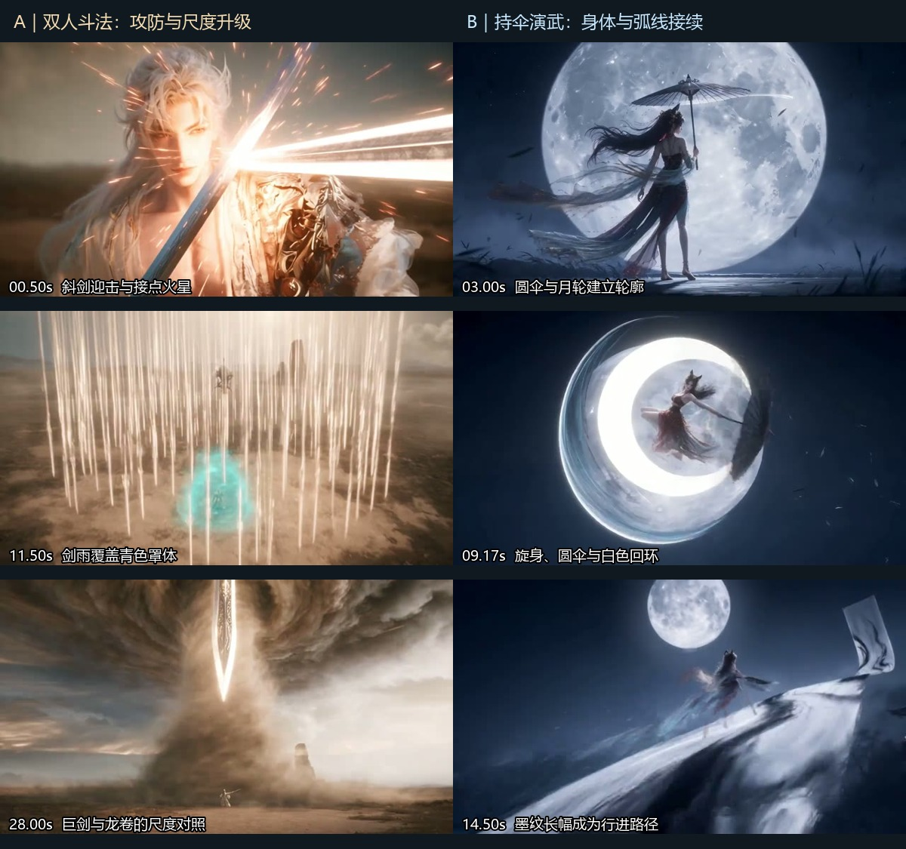

# 两段战斗视频拆解：双人斗法与月下持伞连招

第一段的主要价值是双方攻防接力、两套能力的视觉区分，以及从近身交锋到天地尺度的升级。第二段的主要价值是人物、伞、月轮、弧形轨迹与长幅布景之间的造型统一，以及一招余势接下一招起手的连贯展示。两者可以互补，但第二段没有展示明确对手，不能把其单人连招直接当作完整双人攻防模板。

## 片源与观察范围

| 片段 | 本次附件 | 交付文件规格 | 观察方式 |
| --- | --- | --- | --- |
| A：荒野双人斗法 | 文件名以“1-固定打斗模板30S直出”开头 | 容器30.069909秒；视频30.066667秒，902帧；1280×720，30fps，H.264；含AAC音轨 | 当前附件SHA-256与项目已有片源一致；重新查看已有全部10张6fps序列板，共181个采样帧，另看相邻切点与25秒连续帧 |
| B：月下持伞狐仙 | 文件名以“2-国风狐仙月下无限连”开头 | 容器/视频17.833333秒，535帧；1280×720，30fps，H.264；含AAC音轨 | 新抽取每5帧1张的107个采样帧，查看全部6张序列板；另抽12张形制细节与40张切换/接触局部帧 |

来源、完整元数据与哈希见[sources.json](evidence/paired-combat-2026-10-02/sources.json)。A的复用证据位于[既有证据目录](evidence/uploaded-duel-2026-10-01/metadata.json)，本次未把旧提示词的预期结果当作视频事实。

本次采用带时码的图像序列观察，未正常速度播放并实听音轨。下文可以分析动作先后、画面占时、局部接触和已核对的切换，不能据此断言完整实时速度、精确Hit Stop帧数、音乐节拍或音画同步。时间段是近似事件范围，不是完整镜号表。招式名称均为动作描述性归纳，不冒充原作者命名或已取得的原提示词。

## A：荒野双人斗法

### 六项内容

| 维度 | 可见内容与分析 |
| --- | --- |
| 整体风格 | 写实材质的国风三维仙侠：发丝、皮肤、金属肩饰、织物绣纹较细，荒野黄土与灰金天光形成低饱和底色，白金剑光和青色法术构成高亮主形。动作跨越地面、腾空与风眼，后段以人物和孤峰衬托巨型法术。不能从外观倒推具体渲染引擎。 |
| 战斗人物 | 女方黑色长发高束，蓝白服饰、金银纹饰与飘动袖料；男方银白长发，浅色袍装、深青色衣料和明显金属肩饰。女方频繁变换高度、突进与剑诀施法；男方以持剑拦截、青色横向攻击和罩体防御回应。画面可读到双方争取压制与破防，人物身份、门派和剧情动机未知。 |
| 武器 | 女方可见细长直剑，常以右手持剑、另一手结剑指；周围白金剑形是能量表现，不能都算实体兵器。男方可见青蓝色直剑，开场斜架身前、后续举剑应对。片尾巨剑是超常尺度的发光剑形，不能默认等同手中剑本体变大。局部遮挡下的离手/回握过程不能补造。 |
| 技能招式 | 白金远程剑形→斜剑拦截→青色横扫→腾翻、低身避让与突进→近身架击→青色罩体/冲起→环身剑群、下落剑雨与交织剑网→落地重整、定向破罩→龙卷卷尘→避风滚转、斩击浮石并踏跃→巨剑下贯。多种攻击形态确有变化，不能概括成整场“挥剑发光”。 |
| 命中效果 | 开场兵器附近火星、约4秒退移沟痕、约15.5秒撑地与尘土、约18秒罩体爆散、约23—25秒剑尖/剑路作用到岩块的火星，以及片尾尘浪，是不同层级的反馈。精确伤腕、擦脸、断发或最终倒地等身体结果不能仅凭亮光确认。 |
| 特效光影 | 白金线性剑形负责锐利、穿刺与汇聚感；青色宽面/罩体负责扫掠与阻挡；褐色风尘负责体积与尺度。开场暖色火星照亮男方面部和肩饰，青色光占据人物附近空间。约18秒、28秒出现强烈明暗冲击；强闪提供重音，也降低关键受力姿态的可见度。 |

### 按时间拆解

| 时间 | 动作与战局 | 摄影、效果及其作用 |
| --- | --- | --- |
| 0—约1.2秒 | 白金来势抵达男方身前，男方斜持剑形成防线，随即转为青色攻击朝女方推进。 | 视点沿攻击方向从双方关系进入男方接点，再交给反击方向。先建立“攻击由谁发出、由谁接住”的观看接力。 |
| 约1.2—4.6秒 | 女方腾翻躲过较低青色来势，落地降低重心并迫近；男方举剑应对，青色罩体出现；女方被逼退，地面留下拖痕。 | 全身动作让高度变化和脚下支撑可见，退移沟痕比单纯震屏更能交代力量结果。 |
| 4.6—约8.8秒 | 女方剑指与转身后继续应对青色横扫，低身滑移接近男方，剑路与高位架势形成交锋，随后青色力量向上扩张。 | 女方近景表达意图，再回到双方关系。低身与高位架击在同一交换中形成高度反差；部分精确接点仍被光与运动模糊遮挡。 |
| 约8.8—12.7秒 | 女方升空，白金剑群环身；剑雨下落，青罩承受范围压制，白金剑形继而交织成网。 | 人物特写→人物与剑群→俯视攻击区域。升级来自线性攻击转为范围覆盖和围困，不只是提高亮度。 |
| 约12.7—16.5秒 | 女方在地面移动并向罩体方向进攻，青色防御/反制将其冲起；翻转下落后以低姿撑地恢复。 | 地面移动与天空剑网同框，动作仍有场地关系。落地后能看见支撑姿势和尘土，完成“受压—恢复”的节拍。 |
| 16.5—18.8秒 | 女方抬眼、结剑指，白金攻击进入青罩，出现集中亮点及罩体爆散。 | 近景意图接定向攻击，再拉开显示范围结果。可确认“攻击进入罩体并触发爆散”，无法仅凭此段确认同一旧裂口被精准再次命中。 |
| 18.8—22.7秒 | 风尘聚成贯通天地的龙卷，地面人物成为尺度参照。 | 远景给巨大法术充分的展示占时。此段约占4秒，主要信息是威胁规模，近身交换信息明显减少；不宜把整片理解为每秒都在密集互击。 |
| 22.7—25.6秒 | 女方在近处风尘中翻滚，挥剑处理飞来/悬浮岩块，再踏上岩块跃起。 | 石块同时充当障碍、作用对象与支撑点，形成“环境压力改变移动路线”的较具体实例。不能把对岩块的火星写成对男方身体的命中。 |
| 25.6—27.4秒 | 先见下方男方抬头，再见女方进入前景并在风眼中结印。 | 俯视与遮叠重新交代上下关系。女方进入前景挡住下方男方，不应将其误判为男方突然变成女方。 |
| 27.4—30.07秒 | 巨型白金剑形沿龙卷轴向下贯，强闪后是尘幕、剑形和荒野远景。 | 用巨剑与旋转风柱的形态冲突形成终极爆点。结尾停留在法术/环境后果，未清楚交代双方最终身体状态与胜负。 |

主要证据：[0—3.17秒](evidence/uploaded-duel-2026-10-01/sequence-01.jpg)、[6.67—9.83秒](evidence/uploaded-duel-2026-10-01/sequence-03.jpg)、[10—13.17秒](evidence/uploaded-duel-2026-10-01/sequence-04.jpg)、[13.33—16.5秒](evidence/uploaded-duel-2026-10-01/sequence-05.jpg)、[16.67—19.83秒](evidence/uploaded-duel-2026-10-01/sequence-06.jpg)、[20—23.17秒](evidence/uploaded-duel-2026-10-01/sequence-07.jpg)、[23.33—26.5秒](evidence/uploaded-duel-2026-10-01/sequence-08.jpg)、[26.67—29.83秒](evidence/uploaded-duel-2026-10-01/sequence-09.jpg)。

### 片名声称与实际镜头

本次重新查看相邻源帧，确认至少以下五处画面切换：4.600秒（137→138帧）、16.500秒（494→495）、18.767秒（562→563）、25.600秒（767→768）、27.433秒（822→823）。其中近景/全景、俯视/平视直接变化，没有连续相机运动桥接。证据见[切点对照](evidence/uploaded-duel-2026-10-01/confirmed-cut-pairs.jpg)及[25秒连续帧](evidence/uploaded-duel-2026-10-01/focus-identity-25s.jpg)。

因此成片不属于严格一镜到底。“未经作者手动剪辑”“一次生成”“成片没有切镜”是不同命题；这里只能确认最后一项不成立，前两项缺少制作记录。

### 最值得学习与需要补足的地方

- **可迁移：攻击引导视点交接。** 镜头跟随威胁抵达接点，再接收防守者的反击方向。适合双人斗法；应用时仍需保留双方距离与来路。
- **可迁移：升级改变作用范围。** 单道剑形、横扫、罩体、剑雨、剑网、龙卷和巨剑有不同几何关系，能不断提出新的动作任务。
- **可迁移：环境变成动作条件。** 被逼退留下沟痕，风尘带起石块，石块又成为踏跃支撑。这些结果比孤立粒子爆点更有叙事用途。
- **待补足：精确接点和终局。** 若要讲完整胜负，应在大爆发后给双方支撑、武器和受伤状态可读的画面；现有远景尘暴不能替代这些结果。
- **待补足：展示占时与交换密度。** 近景蓄势和约4秒龙卷远景有展示价值；若要求更连续的对攻，应让这段时间同时发生可辨回应，而非仅增加相机速度。

## B：月下持伞狐仙

### 六项内容

| 维度 | 可见内容与分析 |
| --- | --- |
| 整体风格 | 暗蓝月夜、竹林剪影、临水亭台、地面薄雾与夸张放大的满月；人物采用较细的三维材质，动作与特效偏国风游戏角色展示。灰白、冰青的光轨配少量暗红服饰，后段长幅上出现黑色墨纹。全片视觉词汇较集中。 |
| 战斗人物 | 单一女性角色，黑色长发，狐耳状头部轮廓/装饰，红黑服装、金色饰件、裸足，身后有多条半透明尾状/飘带状长形。长形随动作拖曳并参与轮廓变化；不能从遮叠画面可靠数出“九尾”，也没有清楚证明它们逐条独立攻击。未见明确交战对手。 |
| 武器 | 伞轴深色、细密放射状伞骨、灰白伞面的圆伞，具有纸伞/绢伞外观。可见开伞与收拢形态，单手握轴、另一臂展开辅助姿态；其用途由持握、拖地到抡转和弧形挥击变化。没有稳定展示独立长剑，不应因出现月牙光刃就新增一把剑。 |
| 技能招式 | 持伞登场→眼部发光→低身拖伞滑行→提伞上撩→空中旋身与回环挥伞→月轮前环形造型→俯冲擦地→转体连续弧击→穿破白色长幅→沿卷带状坡面跑动→腾起终结大弧。名称为描述，未取得作者实际招式命名。 |
| 命中效果 | 起动与拖地处出现白色喷溅/擦痕；挥击经过白色屏片或长幅时有碎屑、边缘破散；13.87—14.03秒可见长幅撕裂样缺口与白色碎片扩散。反馈主要落在环境/构件上，没有可辨对手的格挡、硬直、受伤、击退或倒地。 |
| 特效光影 | 满月是强轮廓与构图背景，深蓝环境压暗地面和竹林；眼侧出现冰青光纹，伞路产生白色月牙、圆环和少量青色边缘，尾状/飘带状长形拖出较细光丝。主弧线、细丝与碎片有粗细层次，方向较统一。满月在不同构图中尺度变化显著，应理解为风格化视觉锚点，不作为精确物理光照测量。 |

### 按时间拆解

| 时间 | 可见动作 | 设计作用与边界 |
| --- | --- | --- |
| 0—约1.6秒 | 穿过竹林、水面与亭台建立环境，视点接近人物下肢与飘动长形，角色落脚/行进。 | 从环境进入主体，先交代夜色、雾气与轻盈轮廓；这段属于登场。 |
| 约1.6—2.6秒 | 伞轴、握持手与眼部近景接续，眼旁冰青纹路亮起。 | 道具特写说明角色与伞的关系，眼部变化给能力启动信号。不是对手攻击或身体命中。 |
| 约2.6—3.8秒 | 人物以撑伞背影/侧背轮廓立于巨大月轮前，随后压低重心启动。 | 月轮、圆伞、长发和长尾状轮廓共同建立角色主视觉；约1秒的造型展示不能误报为持续连击。 |
| 约3.8—5.1秒 | 低弓步向前滑行，收拢伞体向后下方拖过地面，后侧接触处拖出亮线与喷溅。 | 保持攻击准备姿态，通过地面擦痕、背景视差和衣尾拖曳表现推进。该处是接地反馈，未见敌人受击。 |
| 约5.1—7.5秒 | 由拖地低位提伞上撩，形成大弧；角色腾起，在竖直白色屏片/长幅间旋身，打开伞面并继续回环挥击。 | 低位来势转为垂直上扬，前一动作的收势成为下一动作起点。前景长幅提供遮挡、纵深和路径参照。 |
| 约7.5—9.9秒 | 人物进一步升高，绕身弧线接近闭环，圆伞与满月重叠，身体转向为下落准备。 | 圆伞、月轮、光环形成重复圆形构图；主要是在强化招式造型。不能把圆环自动解释为传送门或护盾。 |
| 约9.9—10.7秒 | 人物朝镜头方向俯冲，随后贴近地面拉出长亮线，继续弹起。 | 高位势能转为低位横向运动的视觉关系较清楚；接地后进入下一轮动作，没有长时间重摆站姿。 |
| 约10.7—13.5秒 | 在白色长幅之间转体、挥伞、连续绕身弧击；青白细线接在主弧外侧。 | 改变弧线平面、人物高度与取景距离维持变化；未出现可辨对手回应，因此属于连续动作展示。 |
| 约13.5—14.2秒 | 人物掠近镜头，粗白弧扫过画面，白色长幅出现撕裂样破口、碎片和分离的边缘，随后人物出现在倾斜长幅上。 | 本片较明确的环境作用结果。形态支持长幅/屏片破散，但不足以确认其为冰墙、敌方护盾，或每一次穿过都命中实体。 |
| 约14.2—15.8秒 | 角色沿向上弯曲的白色长幅跑动，其表面有明显黑色墨纹。 | 布景从前景障碍转为可行走路径，把平面造型延伸到空间运动。其物理材质和承载机制未解释，属于幻想设定。 |
| 约15.8—17.83秒 | 角色腾起，旋身带出巨大白弧；末段斜向光带充满画面，最后收成黑底细亮线。 | 以图形擦屏结束技能展示。终结光带不等于命中某个对手，也没有形成与片头竹林满月的无缝循环。 |

主要证据：[全片概览](evidence/paired-combat-2026-10-02/fox-overview.jpg)、[0—3.17秒](evidence/paired-combat-2026-10-02/fox-sequence-01.jpg)、[3.33—6.5秒](evidence/paired-combat-2026-10-02/fox-sequence-02.jpg)、[6.67—9.83秒](evidence/paired-combat-2026-10-02/fox-sequence-03.jpg)、[10—13.17秒](evidence/paired-combat-2026-10-02/fox-sequence-04.jpg)、[13.33—16.5秒](evidence/paired-combat-2026-10-02/fox-sequence-05.jpg)、[片尾](evidence/paired-combat-2026-10-02/fox-sequence-06.jpg)。

### “无限连”的准确理解

就画面而言，这是有限时长的单人连续招式展示，没有证据证明游戏机制意义上的无限连段，也不是首尾无缝循环。其连贯主要来自四种接续：

1. **重心接续：** 低身滑行结束时顺势上撩，腾起后旋身，旋身后俯冲，俯冲擦地又接弹起。
2. **兵器接续：** 收拢伞的细长轮廓适合拖地，打开的圆伞适合抡转与环形主视觉；同一道具提供不同形态。
3. **曲线接续：** 身体旋转、伞的弧路、衣尾拖线和能量弧保持相近旋向，前一条曲线把视线引向下一动作。
4. **场景接续：** 白色长幅先遮挡/穿越，再出现破散，后段成为上升跑动路径，帮助动作从地面延伸到高处。

前约3.8秒先完成环境、持伞、眼部与月下定姿，之后才进入主要连招。这是一种“先识别角色，再展示招式”的安排，不宜复制到用户明确要求开场立即接敌的场景。

### 接触、切换与材质的复核

- [13.5—14.13秒连续帧](evidence/paired-combat-2026-10-02/fox-contact-consecutive.jpg)显示：粗白弧掠过→约13.867秒出现碎裂/撕裂样爆散→缺口和条状边缘可见→角色落到/转入倾斜长幅。这支持环境破散，不能延伸成“对手护盾破碎后被击飞”。
- [细节板](evidence/paired-combat-2026-10-02/fox-details-02.jpg)显示后段白色长幅弯曲并带黑色墨纹，更适合描述为卷轴/绢幕状构件。前段直立半透明屏片的具体材质仍未知，不将全部白色竖物武断归为冰柱。
- [相邻帧候选板](evidence/paired-combat-2026-10-02/fox-cut-candidates.jpg)中，2.067→2.100秒（62→63帧）从握伞手直接转为眼部近景，2.567→2.600秒（77→78帧）从眼部近景直接转为月轮前侧背构图，可确认这两处切换。1.10—1.20秒仍能看到连续接近过程，不能把景别变大一律算成切镜；3.8秒和9.867秒候选带掠动/快速尺度变化，不据亮度差自动归入硬切。
- 约7.17秒、13.67秒与17秒附近可见局部方块/阶梯状图像破损。它们存在于本次解码画面中，来源未确定；不把它们解释为主动设计的“像素溶解”“冰屑”或模型必然缺陷。

### 最值得学习与需要补足的地方

- **可迁移：用兵器结构决定动作。** 圆伞与旋身、月牙、回环相容；若迁移到剑、枪或链刃，应重新设计相应发力和回收路径，而非只替换武器名字。
- **可迁移：统一视觉形状。** 月轮、伞面、光环、月牙相互呼应，主色数量克制，视觉识别较集中。适合角色展示、演武、技能预告。
- **可迁移：让收势成为下一招起势。** 滑步—上撩—旋身—俯冲—接地—再起是可迁移的动作关系，不需要照搬狐仙身份与月夜背景。
- **待补足：从演武变成对抗的条件。** 若要双人战斗，需要加入对手的目标、入场距离、格挡/避让、明确接点与结果，以及对手如何迫使持伞者换招。只加一个站着挨打的对手不能自动形成攻防。
- **待补足：尾状长形与场景机制。** 复刻时需选择它们究竟是身体尾部、服装飘带还是能量残留；长幅究竟可承重还是仅作视觉背景，也应明确。现片的漂亮外观不等于这些机制已被证明。

## 横向比较与可复用关系

| 比较点 | A：双人斗法 | B：月下持伞 |
| --- | --- | --- |
| 核心组织 | 对手回应改变下一次攻击，逐级扩大范围 | 单人身体与伞路连续，反复变换弧线和高度 |
| 最强识别 | 白金剑系对青色防御/风暴 | 满月、圆伞、月牙、冰青细丝与红黑人物 |
| 主体与效果 | 法术后段扩大到场地、天地尺度 | 多数效果仍围绕人物和伞的运动展开 |
| 环境用途 | 黄土受力、尘暴封压、浮石妨碍并提供支撑 | 竹林/雾做层次，长幅遮挡、破散、变为路径 |
| 命中证据 | 兵器附近火星、逼退、落地、罩体爆散，终局身体结果弱 | 地面擦痕与长幅破散较明确，未见人体命中 |
| 摄影用途 | 来路接力、接点特写、范围俯视和巨物远景 | 道具/眼部特写、低位跟随、月前剪影与沿弧线转动 |
| 结尾 | 巨剑与尘暴，胜负未明确 | 光弧擦屏收黑，技能展示结束 |
| 适合迁移 | 双人仙侠交锋、范围升级、环境压力 | 持械演武、角色登场、单人技能串联 |

两片共同说明，特效的有效信息至少要回答三件事：**谁或什么产生它、沿什么轨迹作用、画面中的什么发生改变。** A提供对手与环境的改变，B提供身体、兵器和曲线的衔接；合用时应让曲线明确服务于攻击、躲避或支撑转换。

可供后续skill审阅使用的候选规则如下，均为本次观察后的归纳，不是经过新视频试验验证的配方：

1. 先区分“对抗、演武、登场、技能展示”，再决定是否要求对手回应和命中。单人展示可以成立，但不能据此声称双人攻防完整。
2. 特效除颜色外还要有形态与职能：细线穿刺、宽面阻挡、环形回转、体积风场改变移动条件；装饰环不自动拥有防御或传送功能。
3. 武器切换形态时交代动作用途和下一握持状态；实体、投影、尾迹分开追踪。
4. 对抗型连招用前一交换的结果逼出下一招；演武型连招用前一动作的重心、旋向与兵器余势接下一招。
5. 命中按实际作用对象记录：身体、兵器、屏障、地面与构件不能混写；不以亮度峰值证明伤害。
6. 镜头随事件选择覆盖，结尾按作品目标留结果；展示片可在造型峰值结束，胜负片应交代双方终态。

本次新增分析与原片证据，不把两段成片直接写成通用成功案例，也未推断其生成模型、次数、原提示词或后期流程。
